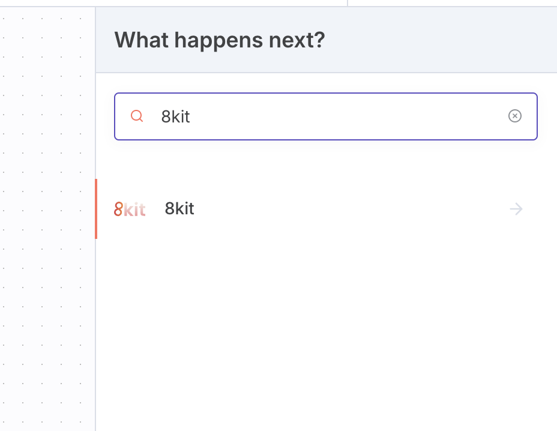
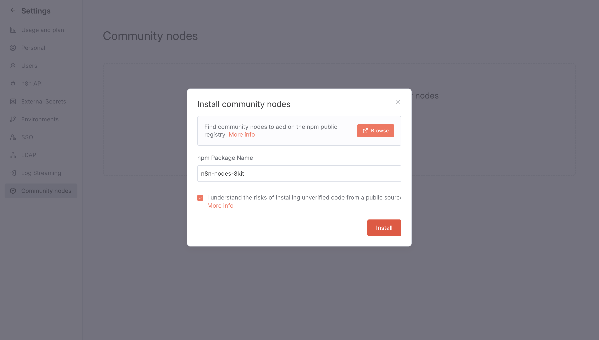
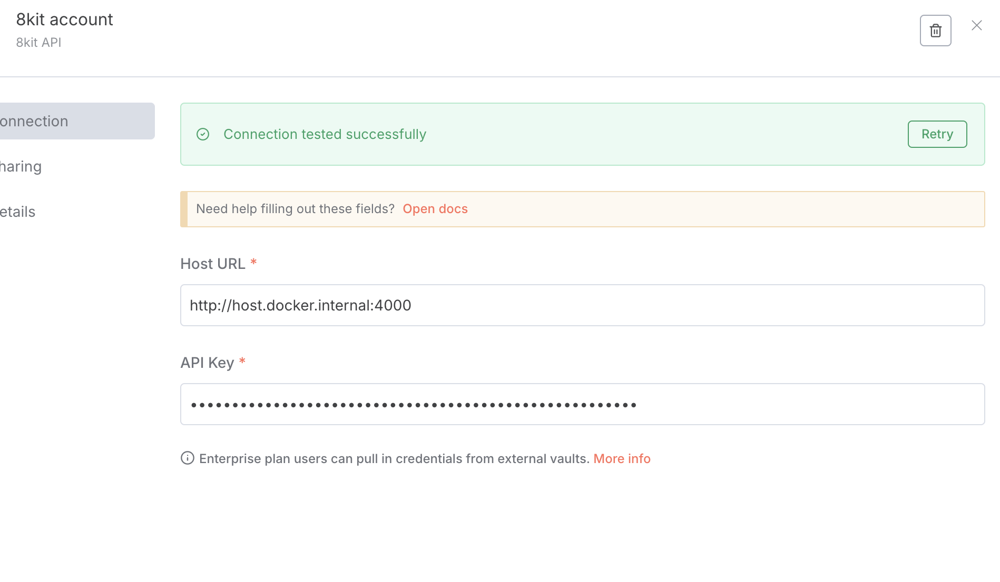
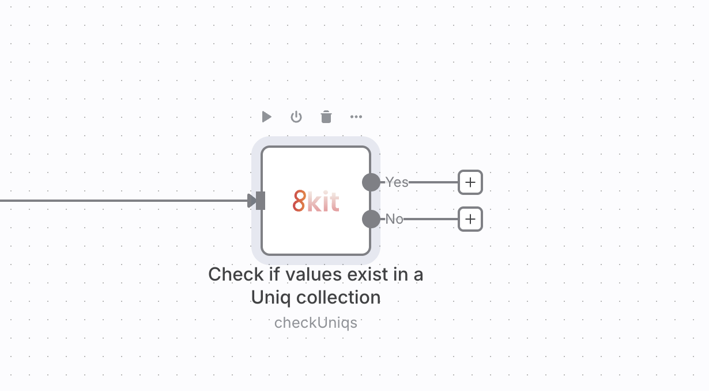
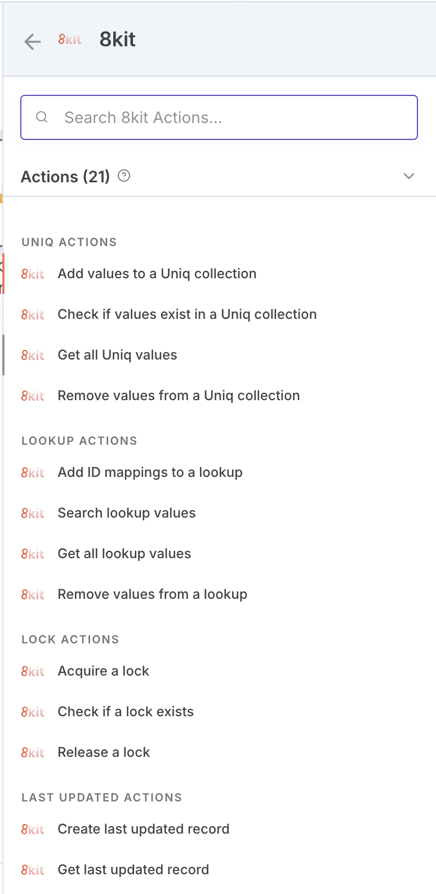

**Essential n8n Node for Reliable Workflows**

*The n8n node that makes your workflows bulletproof*

---

Part of the 8kit n8n integration framework. See [8kit.io](https://8kit.io) for full details.

---

## 🚀 What is the 8kit n8n Node?

The 8kit n8n node brings 8kit capabilities directly into your n8n workflows. Easily access the powerful capabilities of the 8kit suite directly from within n8n (Uniq, Lookup, Lock, App).

### What is 8kit?

8kit is the reliability layer for production n8n workflows: duplicate prevention, ID mapping, locks and timestamps, from this n8n node, a self-hosted server and a dashboard.

### Common Automation Problems 8kit Solves

Running into these frustrating automation challenges?

- **Duplicate Processing** – The same data gets processed multiple times across different runs
- **ID Mapping Chaos** – Customer #123 in one system becomes Customer #456 in another one - now what?
- **Race Conditions** – Multiple processes trying to update the same record simultaneously
- **No Audit Trail** – When something breaks, you have no idea what happened

### How the 8kit n8n Node Helps

Add the 8kit node to your n8n workflows and get:

✅ **Persistent storage** – Your workflows remember everything between runs  
✅ **Smart Deduplication** – Built-in checks prevent duplicate processing  
✅ **Cross-System ID Mapping** – Seamlessly connect data between different platforms  
✅ **Distributed Transactions** – Prevent conflicts in multi-process environments

## 🔧 Getting Started with 8kit in n8n

### Step 0: Prerequisites

You need access to a running 8kit service before the node can do useful work. Configure your own instance by following the [8kit documentation](https://8kit.io/docs).

### Step 1: Install the 8kit n8n Node

1. **Search for 8kit in the n8n sidebar**
   - Open your n8n instance
   - Look for "8kit" in the node sidebar on the right
   - If you can't find the 8kit node, see the step below.
  
   

2. **Install via Community Nodes (if not found)**
   - Go to **Settings** → **Community Nodes**
   - Click **Install a community node**
   - Enter the package name: `n8n-nodes-8kit`
   - Click **Install**

   

### Step 2: Create the 8kit API credentials

 1. **Create new credentials**

- Go to the credentials section in n8n
- Select **8kit API** as the credential type
- Fill in the required fields:

   | Field | Description |
   | --- | --- |
   | `Host URL` | Base URL of the service API, such as `http://host.docker.internal:3000`. |
   | `API Key` | API key generated on the API Keys page of the 8kit admin dashboard. (See more [8kit.io](https://8kit.io)) |

   
   (Example of an 8kit service running locally on port 3000) 

1. **Test the connection**
   - Click **Test** to verify your credentials work

The credential is reused across every 8kit node in a workflow.

## Actions

When using 8kit nodes, each operation returns structured items on distinct outputs (for example existing vs non-existing Uniq values) so you can branch logic without manual parsing.

For Uniq values, **Add** has two outputs: *Added* for values stored for the first time and *Duplicate* for values that were already there (the existing record is returned). With **Continue on fail** enabled, items that fail (validation or server error) go to the second output with an `error` field, never to *Added*. Lookup Values → **Remove** can remove by value id, or by left/right value (all matching rows). **Check Exists**, **Check Lock** and **Acquire Lock** have *Yes* / *No* outputs.

Available operations include:

🔄 **Uniq Collections & Uniq Values**

- Track processed items, user preferences, or configuration data
- Operations: Create Uniq Collection, List Uniq Collections, Get Uniq Collection Info, Get Uniq Values, Add to Uniq, Check Uniq Values, Remove from Uniq

🔗 **Lookup Collections & Lookups**

- Map identifiers across different platforms seamlessly
- Operations: Create Lookup Collection, List Lookup Collections, Get Lookup Values, Add to Lookup, Complete Lookup + Uniq, Remove from Lookup

🔒 **Locks**

- Manage distributed transactions for resource coordination
- Prevent race conditions
- Operations: Acquire Lock, Check Lock, Release Lock

⏰ **Last Updated**

- Track when workflow processed something
- Operations: Add New Last Updated, Get Last Updated

 

## 📚 Resources

- **📖 [Complete Documentation](https://8kit.io/docs)** – Learn everything about 8kit deployment and APIs
- **💻 [GitHub Repository](https://github.com/8kit-io/n8n-node-8kit-community)** – Source code and community contributions
- **💬 [Discord Community](https://8kit.io/community)** – Get help and share experiences

## n8n Community

This community node is built by n8n users, for n8n users. Whether you're just getting started with n8n workflows or you're a seasoned automation expert, join our community to share experiences and get help!

---

**Ready to supercharge your n8n workflows?**

[Get Started with 8kit](https://8kit.io/docs) | [View on GitHub](https://github.com/8kit-io/n8n-node-8kit-community)

Brought to you by [Stratagems](https://stratagems.com).
